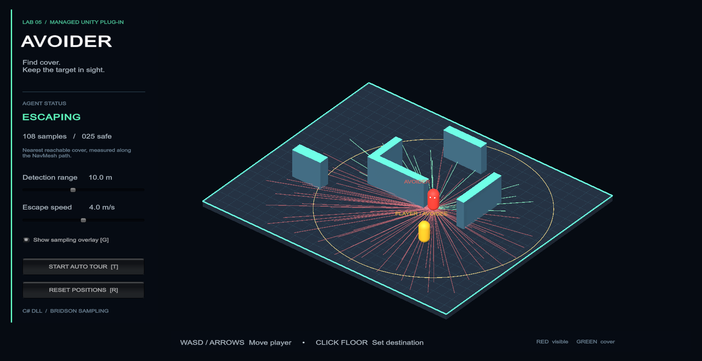

# Avoider — Lab 5

A managed C# plug-in that makes a Unity NavMeshAgent retreat to cover while facing a moving player. Includes the compiled DLL, its separate Visual Studio solution, and a playable Unity showcase.



## Run the showcase

1. Open this repository as a Unity project with **Unity 6000.2.8f1**.
2. Open `Assets/AvoiderShowcase/Scenes/AvoiderShowcase.unity`.
3. Press **Play**. Move the yellow player using **WASD / arrow keys**, or **click the floor** to set a destination. The coral agent searches for cover when the player is nearby and has an unobstructed line of sight.
4. Adjust **Detection range** and **Escape speed** with the on-screen sliders. Use **G** for the sample overlay, **T** for an automatic player tour, and **R** to reset.

If the Game view is cropped, set its **Scale** slider to **1x** (or Fit); 1440 × 900 is the recommended recording size.

The inspector's **Show Gizmos** checkbox controls Scene view gizmos. The showcase overlay also works in Game view and a standalone build. Green lines mark hidden, reachable points; red marks visible points; the cyan line indicates the chosen destination. The amber circle shows the detection range. Samples show the most recent search and remain visible while the agent hides.

The scene includes a saved, baked NavMesh. **Avoider → Create Showcase Scene** regenerates the demonstration and rebakes it; this replaces the generated showcase scene and its generated materials. The original template SampleScene is retained.

## Plug-in files

- `Assets/Plugins/Avoider/Avoider.dll` — the actual managed plug-in used by Unity.
- `PluginSource/Avoider.sln` — open this in Visual Studio.
- `PluginSource/Avoider/Avoider.cs` — the MonoBehaviour and escape logic.
- `PluginSource/Avoider/PoissonDiscSampler.cs` — original Bridson-style sampling implementation.
- `Assets/AvoiderShowcase/` — demonstration controls, generated scene/materials, and editor utilities.

The plug-in source lives **outside Assets** to avoid compiling duplicate component definitions. Its runtime DLL has no dependency on UnityEditor, the Input System, or the AI Navigation package. The showcase uses the project's existing Input System and AI Navigation packages.

## Build the DLL in Visual Studio

Use Visual Studio 2022 with .NET development tools and a .NET SDK that supports .NET Standard 2.1. Open `PluginSource/Avoider.sln`, select **Release / Any CPU**, and choose **Build Solution**. The project references the installed Unity engine assemblies and copies the resulting DLL into `Assets/Plugins/Avoider/` after a successful build.

If Unity is installed elsewhere, change the `UnityEditorPath` property in `PluginSource/Avoider/Avoider.csproj`, or pass it to MSBuild:

```powershell
dotnet build PluginSource/Avoider.sln -c Release -p:UnityEditorPath="D:\Unity\6000.2.8f1\Editor"
```

An offline fallback uses the C# compiler and reference assemblies bundled with Unity:

```powershell
./Tools/Build-Plugin.ps1
# Or specify another editor installation:
./Tools/Build-Plugin.ps1 -UnityEditorPath 'D:\Unity\6000.2.8f1\Editor'
```

Only distribute `Avoider.dll`; Unity already provides the referenced UnityEngine assemblies. This delivery was compiled using the bundled compiler; the Visual Studio solution is included for editing and rebuilding.

## Add Avoider to another scene

1. Copy the DLL into the destination project's `Assets/Plugins/` directory.
2. Create walkable geometry and solid cover. Bake a NavMesh using a NavMeshSurface.
3. Add a **NavMeshAgent** and **AI → Avoider** to the actor's root object. Put the root at foot level, with visuals/colliders as children.
4. Drag the player root into **Avoidee**. Set **Range**, **Speed**, and **Show Gizmos**.
5. Set **Occluder Mask** to layers containing opaque cover. Set **Eye Height** to the sight-test height above each actor's root.

The component logs actionable warnings for a missing/disabled NavMeshAgent, missing/invalid avoidee, or an agent off the baked mesh. The showcase custom inspector adds a warning and an **Add NavMeshAgent** button. The standalone DLL still supplies the runtime warnings without the custom inspector.

## Behavior

Every 0.4 seconds by default, the agent checks distance and visibility. While in range and exposed, it creates Poisson-disc samples in a square around itself, retaining those inside the search radius. Samples have a minimum spacing before NavMesh projection; projection can move or merge nearby samples.

It projects samples onto the matching agent-type NavMesh, rejects visible points, and requires a complete navigation path. The closest hiding spot means **shortest complete path length**, which avoids selecting a point that is close across a wall but takes a long detour. A still-hidden destination is retained while moving to prevent target jitter. Once concealed, the agent stops and checks again; it reacts when the player moves around the obstacle and reveals it. If the player leaves the range or no reachable cover exists, the agent stops safely and retries later.

The actor faces the player even while moving sideways/backward. NavMesh rotation is disabled while Avoider controls the actor and restored when the component is disabled. “Sight” here means a 360-degree unobstructed line at eye height, rather than a camera field-of-view cone. Raycasts ignore triggers and both actor hierarchies. This prototype targets a single-floor arena; it does not model partial-body exposure or multiple floor levels.

The sampler uses a seeded private random generator, a spatial hash with cell size r / sqrt(2), an active list, and up to 30 candidates in an annulus per active point. Sampling work is capped with **Max Samples**. Physics queries allocate arrays, and path queries are synchronous; increase the interval/reduce samples for many agents.

## Validation and player build

Open the showcase and select **Avoider → Run Validation** with Play mode stopped. The runner checks sample spacing/bounds across 12 seeds, wall occlusion, shortest reachable hiding path, actual movement into cover, facing, reaction to player relocation, out-of-range behavior, no-cover behavior, and missing/off-mesh setup. It enters and leaves Play mode automatically and writes reports under `Artifacts/`. Deliberately invalid setup tests produce expected warnings.

Select **Avoider → Build Windows Showcase** to produce `Builds/Windows/AvoiderShowcase.exe`. Share the entire Windows build directory, not just the executable. Build outputs and local reports are excluded from Git.

## Submission

- GitHub repository: **pending repository selection**.
- Group members: **pending names from the group** (see `GROUP_MEMBERS.md`).
- Plug-in source: included under `PluginSource/`.
- Video: recorded and submitted by the student.

See `Docs/SubmissionChecklist.md` for a short demonstration outline and repository instructions.

## References

- [Unity managed plug-ins](https://docs.unity3d.com/Manual/plug-ins-managed.html) — DLL integration and Unity assembly references.
- [Robert Bridson, Fast Poisson Disk Sampling in Arbitrary Dimensions (2007)](https://www.cs.ubc.ca/~rbridson/docs/bridson-siggraph07-poissondisk.pdf) — algorithm reference. The sampler here is an original implementation, not a copy of tutorial source.
- [Greg Schlom's Unity Poisson-disc tutorial](https://gregschlom.com/devlog/2014/06/29/Poisson-disc-sampling-Unity.html) — assignment-provided background link.

All showcase geometry and materials are generated primitives; no third-party art assets are required.
